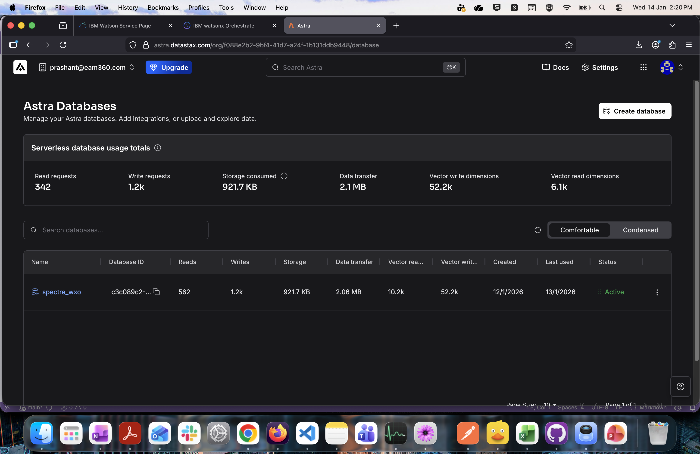
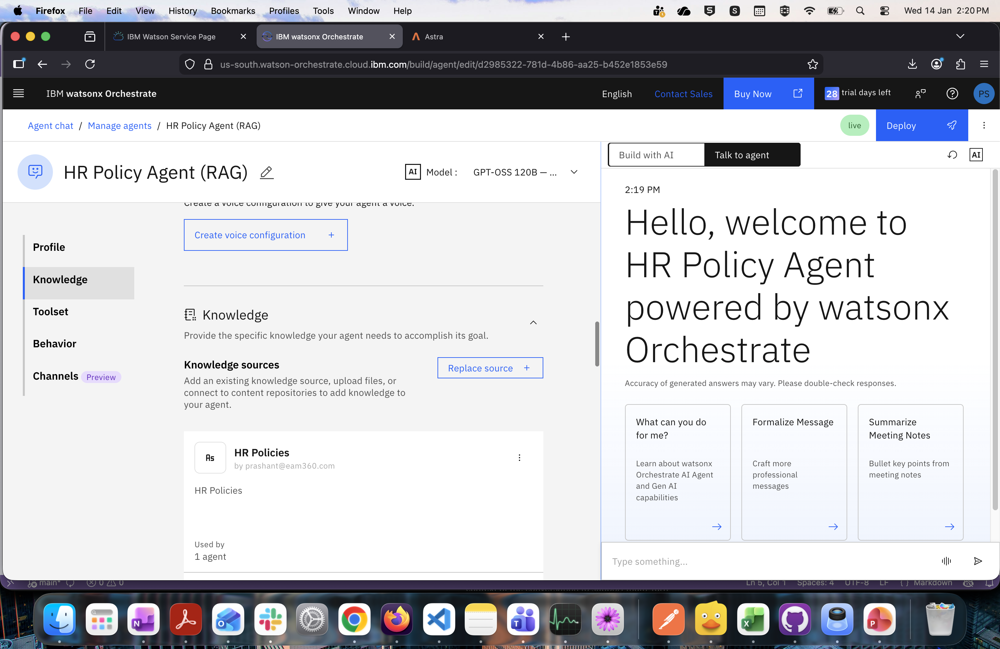

# Watsonx Orcestrate HR Policy Agent using RAG
Agent which answers questions related with HR Policy using company's internal knowledge stored into RAG.

## RAG Connection Details
Create connection with Astra Vector DB on Cloud. Astra vector DB provides the ability to load data like PDFs directly. Below screne shots shows details of configuration performed :







## Add Cloud Environment:
``` 
orchestrate env add -n <environment-name> -u <service-instance-url> --type ibm_iam --activate 
```

## Activate Environment:
``` 
orchestrate env activate <<environment-name>>
``` 

## List all Environment Added:
``` 
orchestrate env list
``` 

## Import Agent:
``` 
orchestrate agents import -f /Users/prashantsharma/Documents/GitHub/wxoadk_hrpolicy_rag_agent/agents/hrpolicy_rag_agent.yaml
``` 

## List Agents:
``` 
orchestrate agents list
``` 